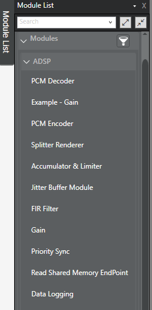

.. _available_modules:

Available Audio Modules
#######################

This page provides a quick overview of all the current available audio algorithms, or modules, on AudioReach. These have been validated on Raspberry Pi 4.

More information about the configurable parameters and capabilities of these modules can be found in AudioReach Creator. To view this, clone the reference ACDB files in the audioreach-conf repository, and then open it in ARC.
On the top bar, find View -> Module List. The list of modules will appear on the left. (Please note that not all modules available in the Module List have been added to the opensource project).

+-----------------------------------+------------------------------------------------------------------------+-------------------------------------------------+-----------------------------------------+------------------+
| **Module Name**                   | **Description**                                                        | **Source code path**                            | **Dependencies**                        | **Binary/Source**|
+===================================+========================================================================+=================================================+=========================================+==================+
| PCM Converter                     | | The PCM converter is used to convert the properites of a PCM stream, | modules/cmn/pcm_mf_cnv                          | IIR & dynamic resamplers, channel mixer | Source           |
|                                   | | such as the endianness, interleaving, bit width, number of channels, |                                                 |                                         |                  |
|                                   | | data format converter, etc. The PCM converter, MFC, PCM deocder,     |                                                 |                                         |                  |
|                                   | | and PCM encoder are compiled together. However, they can be used as  |                                                 |                                         |                  |
|                                   | | separate modules in AudioReach Creator.                              |                                                 |                                         |                  |
|                                   |                                                                        |                                                 |                                         |                  |
|                                   |                                                                        |                                                 |                                         |                  |
|                                   |                                                                        |                                                 |                                         |                  |
+-----------------------------------+------------------------------------------------------------------------+-------------------------------------------------+-----------------------------------------+------------------+
| Accumulator & Limiter             | | The Accumulator & Limiter is also known as SAL                       | modules/cmn/simple_accumulator_limiter          | Limiter                                 | Source           |
|                                   | | (simple accumulator limiter). It can be used to mix concurrent PCM   |                                                 |                                         |                  |
|                                   | | streams. When using SAL, you must ensure that all of the input       |                                                 |                                         |                  |
|                                   | | streams are of the same data format.                                 |                                                 |                                         |                  |
|                                   |                                                                        |                                                 |                                         |                  |
|                                   |                                                                        |                                                 |                                         |                  |
|                                   |                                                                        |                                                 |                                         |                  |
|                                   |                                                                        |                                                 |                                         |                  |
+-----------------------------------+------------------------------------------------------------------------+-------------------------------------------------+-----------------------------------------+------------------+
| PCM Decoder                       | | The PCM decoder and encoder modules are under the "modules/audio"    | modules/audio/pcm_decoder                       | None                                    | Source           |
|                                   | | folder, but they are compiled in the PCM converter build file.       |                                                 |                                         |                  |
|                                   | | However, they are separate modules in ARC.                           |                                                 |                                         |                  |
|                                   |                                                                        |                                                 |                                         |                  |
|                                   |                                                                        |                                                 |                                         |                  |
|                                   |                                                                        |                                                 |                                         |                  |
|                                   |                                                                        |                                                 |                                         |                  |
|                                   |                                                                        |                                                 |                                         |                  |
+-----------------------------------+------------------------------------------------------------------------+-------------------------------------------------+-----------------------------------------+------------------+
| PCM Encoder                       | | Encodes PCM streams.                                                 | modules/audio/pcm_encoder                       | None                                    | Source           |
|                                   |                                                                        |                                                 |                                         |                  |
|                                   |                                                                        |                                                 |                                         |                  |
|                                   |                                                                        |                                                 |                                         |                  |
|                                   |                                                                        |                                                 |                                         |                  |  
|                                   |                                                                        |                                                 |                                         |                  |
|                                   |                                                                        |                                                 |                                         |                  |
|                                   |                                                                        |                                                 |                                         |                  |
+-----------------------------------+------------------------------------------------------------------------+-------------------------------------------------+-----------------------------------------+------------------+
| MFC                               | | MFC stands for Media Format Converter. It is compiled as a part of   | modules/cmn/pcm_mf_cnv                          | IIR & dynamic resamplers, channel mixer | None             |
|                                   | | PCM converter, but the source code for MFC is not available.         |                                                 |                                         |                  |
|                                   | | You can, however, use MFC as a standalone module in ARC.             |                                                 |                                         |                  |
|                                   | | MFC has many configurable properties in ARC. It allows you to        |                                                 |                                         |                  |
|                                   | | resample streams, change channel mixer coefficients, and set the     |                                                 |                                         |                  |  
|                                   | | output media format (sample rate, bit_width, and number of channels).|                                                 |                                         |                  |
|                                   | | MFC has all the functionality of the channel_mixer, iir resampler,   |                                                 |                                         |                  |
|                                   | | and dynamic resampler modules.                                       |                                                 |                                         |                  |
+-----------------------------------+------------------------------------------------------------------------+-------------------------------------------------+-----------------------------------------+------------------+
| Channel Mixer                     | | Channel mixer will upmix or downmix channels based on the            | modules/processing/channel_mixer                | None                                    | Source           |
|                                   | | configured coefficients.                                             |                                                 |                                         |                  |
|                                   |                                                                        |                                                 |                                         |                  |
|                                   |                                                                        |                                                 |                                         |                  |
|                                   |                                                                        |                                                 |                                         |                  |  
|                                   |                                                                        |                                                 |                                         |                  |
|                                   |                                                                        |                                                 |                                         |                  |
|                                   |                                                                        |                                                 |                                         |                  |
+-----------------------------------+------------------------------------------------------------------------+-------------------------------------------------+-----------------------------------------+------------------+
| FIR Filter                        | | FIR stands for "Finite Impulse Response" tuning filter module.       | modules/processing/filters/fir                  | None                                    | Source           |
|                                   | | It supports multi-channel filtering.                                 |                                                 |                                         |                  |
|                                   |                                                                        |                                                 |                                         |                  |
|                                   |                                                                        |                                                 |                                         |                  |
|                                   |                                                                        |                                                 |                                         |                  |  
|                                   |                                                                        |                                                 |                                         |                  |
|                                   |                                                                        |                                                 |                                         |                  |
|                                   |                                                                        |                                                 |                                         |                  |
+-----------------------------------+------------------------------------------------------------------------+-------------------------------------------------+-----------------------------------------+------------------+
| MS-IIR Filter                     | | MS-IIR stands for multi-stage IIR Filter.                            | modules/processing/filters/multi_stage_iir      | None                                    | Source           |
|                                   | | This is a multiple channel tuning filter module.                     |                                                 |                                         |                  |
|                                   |                                                                        |                                                 |                                         |                  |
|                                   |                                                                        |                                                 |                                         |                  |
|                                   |                                                                        |                                                 |                                         |                  |  
|                                   |                                                                        |                                                 |                                         |                  |
|                                   |                                                                        |                                                 |                                         |                  |
|                                   |                                                                        |                                                 |                                         |                  |
+-----------------------------------+------------------------------------------------------------------------+-------------------------------------------------+-----------------------------------------+------------------+
| Limiter                           | | Limiter cannot be used as a standalone module in ARC. However, it is | modules/processing/gain_control/limiter         | None                                    | Source           |
|                                   | | a dependency for other modules, such as SAL and IIR_MBDRC.           |                                                 |                                         |                  |
|                                   |                                                                        |                                                 |                                         |                  |
|                                   |                                                                        |                                                 |                                         |                  |
|                                   |                                                                        |                                                 |                                         |                  |  
|                                   |                                                                        |                                                 |                                         |                  |
|                                   |                                                                        |                                                 |                                         |                  |
|                                   |                                                                        |                                                 |                                         |                  |
+-----------------------------------+------------------------------------------------------------------------+-------------------------------------------------+-----------------------------------------+------------------+
| Popless Equalizer                 | | A basic tuning and equalizing module.                                | modules/processing/PoplessEqualizer             | MS-IIR Filter                           | Source           |
|                                   |                                                                        |                                                 |                                         |                  |
|                                   |                                                                        |                                                 |                                         |                  |
|                                   |                                                                        |                                                 |                                         |                  |
|                                   |                                                                        |                                                 |                                         |                  |  
|                                   |                                                                        |                                                 |                                         |                  |
|                                   |                                                                        |                                                 |                                         |                  |
|                                   |                                                                        |                                                 |                                         |                  |
+-----------------------------------+------------------------------------------------------------------------+-------------------------------------------------+-----------------------------------------+------------------+
| Dynamic Resampler                 | | The dynamic resampler can be used to convert PCM stream to any       | modules/processing/resamplers/dynamic_resampler | None                                    | | Binary         |
|                                   | | arbitrary sample rate. Dynamic resampler does not have a standalone  |                                                 |                                         | | 32-bit ARM     |
|                                   | | module in ARC, but it can be used through the MFC module.            |                                                 |                                         |                  |
|                                   |                                                                        |                                                 |                                         |                  |
|                                   |                                                                        |                                                 |                                         |                  |  
|                                   |                                                                        |                                                 |                                         |                  |
|                                   |                                                                        |                                                 |                                         |                  |
|                                   |                                                                        |                                                 |                                         |                  |
+-----------------------------------+------------------------------------------------------------------------+-------------------------------------------------+-----------------------------------------+------------------+
| IIR Resampler                     | | IIR resampler is a basic SW resampler that uses an efficient         | modules/processing/resamplers/iir_resampler     | None                                    | | Binary         |
|                                   | | implementation based on IIR filters. It also does not have a         |                                                 |                                         | | 32-bit ARM     |
|                                   | | standalone module in ARC, but it can be used through the MFC module. |                                                 |                                         |                  |
|                                   |                                                                        |                                                 |                                         |                  |
|                                   |                                                                        |                                                 |                                         |                  |  
|                                   |                                                                        |                                                 |                                         |                  |
|                                   |                                                                        |                                                 |                                         |                  |
|                                   |                                                                        |                                                 |                                         |                  |
+-----------------------------------+------------------------------------------------------------------------+-------------------------------------------------+-----------------------------------------+------------------+
| Gain                              | | The Gain module is used to increase and decrease the volume of       | modules/processing/volume_control/capi/gain     | None                                    | Source           |
|                                   | | streams. The layout for both gain and volume control is a little bit |                                                 |                                         |                  |
|                                   | | different. The build file for gain can be found under                |                                                 |                                         |                  |
|                                   | | "processing/volume_control/capi/gain/build." However, the source code|                                                 |                                         |                  |
|                                   | | for both gain and soft volume modules is under "volume_control/lib". |                                                 |                                         |                  |  
|                                   |                                                                        |                                                 |                                         |                  |
|                                   |                                                                        |                                                 |                                         |                  |
|                                   |                                                                        |                                                 |                                         |                  |
+-----------------------------------+------------------------------------------------------------------------+-------------------------------------------------+-----------------------------------------+------------------+
| Volume Control                    | | Volume Control includes basic volume controls, such as gain and mute.| modules/processing/volume_control/capi/soft_vol | None                                    | Source           |
|                                   | | It can also be used to change the volume for each individual channel,|                                                 |                                         |                  |
|                                   | | or there is an option for "master gain" that will set the gain for   |                                                 |                                         |                  |
|                                   | | all channels at once.                                                |                                                 |                                         |                  |
|                                   |                                                                        |                                                 |                                         |                  |  
|                                   |                                                                        |                                                 |                                         |                  |
|                                   |                                                                        |                                                 |                                         |                  |
|                                   |                                                                        |                                                 |                                         |                  |
+-----------------------------------+------------------------------------------------------------------------+-------------------------------------------------+-----------------------------------------+------------------+
