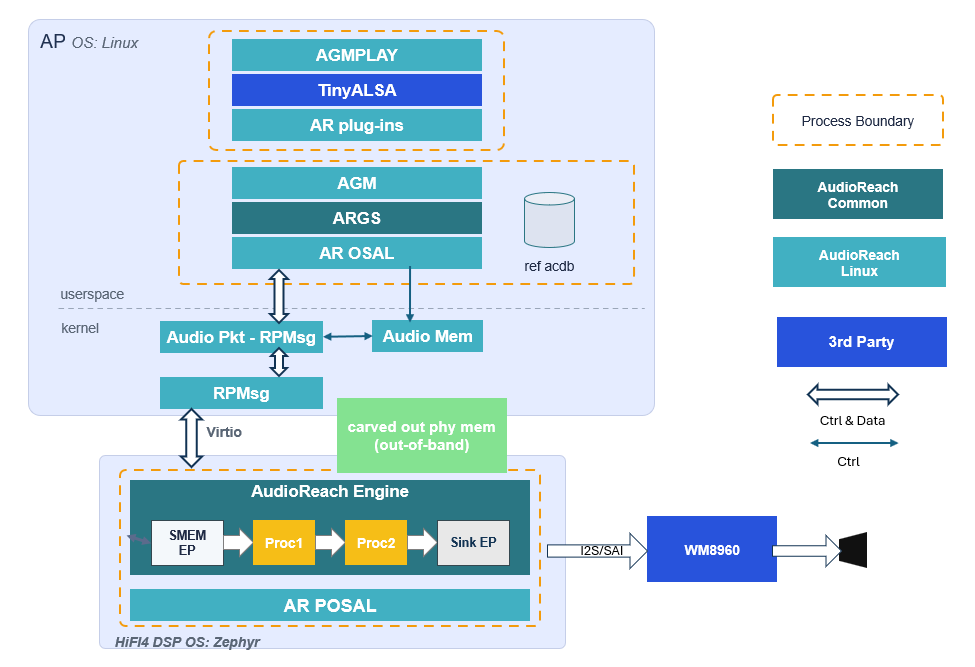

.. _nxp_imx8m:

NXP IMX8M Plus
#################

.. contents::
   :local:
   :depth: 2

This guide provides an AudioReach architecture overview on the NXP IMX8M Plus platform and
walks through the steps to create a Yocto image that integrates AudioReach, create a Zephyr
image for the HiFi ADSP, set up the device, and run an AudioReach usecase.

Architecture Overview
=====================

The above architecture diagram illustrates the simulated playback usecase on the NXP IMX8M Plus
using AudioReach. The platform has a heterogeneous multi-processor design: the AudioReach Engine
(ARE) runs on the HiFi ADSP under Zephyr OS, while the rest of the AudioReach stack — AudioReach
Graph Services (ARGS), Audio Graph Manager (AGM), and the ACDB — runs on the APPS processor
under Linux.

When a graph open request is received by ARGS from the client (``agmplay``), ARGS retrieves the
audio graph and calibration data from the Audio Calibration Database (ACDB) using the usecase
handle and calibration handle. It then provides the graph definition and calibration data to ARE
on the ADSP via the Generic Packet Router (GPR) protocol.

GPR messages are transported across the two processors using the RPMsg framework, which is built
on top of Virtio rings (vrings) over shared memory. The control path (graph open, close, and
parameter set commands) uses GPR over RPMsg, while audio data is exchanged between the APPS
processor and the ADSP through a shared memory region mapped to both processors.

Upon receiving the graph definition, ARE on the ADSP forms an audio processing graph. In the
current simulated playback usecase, the Rate-Adapted Timer module periodically signals the APPS
processor to feed more data into the pipeline. There is not yet a hardware endpoint module for
the NXP board, so no audio is rendered to a physical output device. The endpoint module is
currently in development.

The graph topology can be visualized in real time during an active usecase using the PC-based
GUI tool AudioReach Creator (ARC, also known as QACT).

.. figure:: images/nxp_playback_use_case_topology.png
   :figclass: fig-center
   :scale: 100 %

The above diagram shows the usecase graph currently enabled for the NXP IMX8M Plus.

.. _nxp_step1:

Step 1: Create a Yocto Image
============================

To create a Yocto image, follow the guide at the
`official NXP GitHub page <https://github.com/nxp-imx/meta-imx/tree/scarthgap-6.6.52-2.2.2>`_.
AudioReach currently supports the scarthgap version of Yocto on NXP board.

.. note::
   If there is an error in the repo init step, append the following flags to the repo init command:

   .. code-block:: bash

      --no-repo-verify --repo-url=http://android.googlesource.com/tools/repo

For the IMX 8M Plus, use the following setup command to create the build folder.
Run this from the directory that will serve as ``<yocto_build_root>`` — the root
directory containing the ``sources/`` and ``build/`` folders:

.. code-block:: bash

   MACHINE=imx8mpevk DISTRO=fsl-imx-wayland source ./imx-setup-release.sh -b ./build

Once the build is synced and the setup is complete, run the following command to generate the
full build:

.. code-block:: bash

   bitbake imx-image-multimedia

.. note::
   If the bitbake command gives a ``umask`` error, run ``umask 022`` and try again.

Integrate AudioReach Components
-------------------------------

Navigate to ``<yocto_build_root>/sources`` and clone the meta-audioreach repository:

.. code-block:: bash

   git clone https://github.com/AudioReach/meta-audioreach.git -b scarthgap

Open ``<yocto_build_root>/build/conf/bblayers.conf`` and append the following line under the
``BBLAYERS ?= " \`` section to integrate the AudioReach meta layer:

.. code-block:: text

   <yocto_build_root>/sources/meta-audioreach \

Open ``<yocto_build_root>/build/conf/local.conf`` and append the following lines to include the
AudioReach components in the full Yocto build:

.. code-block:: bash

   IMAGE_INSTALL:append = "audioreach-graphservices tinyalsa audioreach-graphmgr audioreach-conf audioreach-kernel"
   PACKAGECONFIG:pn-audioreach-graphmgr = "use_default_acdb_path"
   PACKAGECONFIG:append:pn-audioreach-graphservices = " audio_dma_support"
   EXTRA_OECONF:append:pn-audioreach-conf = " --with-nxp"

Before running the final build, apply the following change to the Linux kernel device tree.
The ``audioreach-kernel`` package includes the ``q6apm_audio_mem`` driver, which manages shared
memory between the APPS processor and the ADSP. This driver probes on the ``qcom,q6apm-dais``
compatible string to enable the audio memory device node.

Use ``devtool modify`` to check out the kernel source into the workspace:

.. code-block:: bash

   devtool modify virtual/kernel

In ``<yocto_build_root>/sources/linux-imx/arch/arm64/boot/dts/freescale/imx8mp-evk-dsp.dts``,
add the following inside the root ``/ { }`` block:

.. code-block:: dts

   q6apmdai: dais {
      compatible = "qcom,q6apm-dais";
   };

Once the configuration is complete, run the following command to generate the full build with
the integrated AudioReach components:

.. code-block:: bash

   bitbake imx-image-multimedia

.. _nxp_step2:

Step 2: Create a Zephyr Image
=============================

This step produces a Zephyr firmware image with the AudioReach Engine (ARE) integrated as the
DSP component running on the HiFi ADSP. ARE is added to the Zephyr build as a west module,
registered in the workspace manifest and built as part of the Zephyr build system.
The ``zephyr/module.yml`` file in the ``audioreach-engine`` repository declares it as a
Zephyr module, exposing its Kconfig options and CMake build targets to the Zephyr build
system.

The ``audioreach-engine`` module provides the core Signal Processing Framework (SPF), the
Platform & Operating System Abstraction Layer (POSAL), and the Generic Packet Router (GPR) as
Zephyr-compatible libraries. A sample Zephyr application under ``audioreach-engine/app/``
demonstrates the use of the module. This application initializes the three core components
— POSAL, GPR, and the ARE framework — and serves as the entry point for the Zephyr
firmware image that runs on the ADSP.

The steps below cover installing dependencies, setting up the west workspace, applying patches,
and building the image.

Install Dependencies
--------------------

Before setting up the workspace, install the required dependencies. Follow the relevant sections
of the `Zephyr getting started guide <https://docs.zephyrproject.org/latest/develop/getting_started/index.html>`_
for your operating system:

Host Tool Dependencies
^^^^^^^^^^^^^^^^^^^^^^

Follow the `Install dependencies <https://docs.zephyrproject.org/latest/develop/getting_started/index.html#install-dependencies>`_
section of the Zephyr getting started guide to install the required host tools (CMake, Python,
DTC) for your OS.

Python Dependencies and West
^^^^^^^^^^^^^^^^^^^^^^^^^^^^

Follow the `Get Zephyr and install Python dependencies <https://docs.zephyrproject.org/latest/develop/getting_started/index.html#get-zephyr-and-install-python-dependencies>`_
section of the Zephyr getting started guide to set up a Python virtual environment and install
``west``.

.. note::
   Activate the virtual environment every time you start working:

   .. code-block:: bash

      source ~/zephyrproject/.venv/bin/activate

Zephyr SDK
^^^^^^^^^^

Install the Zephyr SDK version **0.17.0**, which is compatible with the Zephyr version used by
AudioReach. Refer to the
`Install the Zephyr SDK <https://docs.zephyrproject.org/latest/develop/getting_started/index.html#install-the-zephyr-sdk>`_
section of the Zephyr getting started guide, and use the following command to install the
specific version:

.. code-block:: bash

   west sdk install --version 0.17.0

.. note::
   Use ``west sdk install --help`` to see additional options such as specifying the installation
   destination or selecting specific architecture toolchains.

Setup the West Workspace
------------------------

Create a directory to serve as the west workspace root and clone the ``audioreach-engine``
repository into it:

.. code-block:: bash

   mkdir <workspace_dir> && cd <workspace_dir>
   git clone https://github.com/AudioReach/audioreach-engine.git

The ``audioreach-engine`` repository contains a ``west.yml`` manifest file located under the
``zephyr/`` subdirectory (``zephyr/west.yml``). This manifest defines all required dependencies,
including the Zephyr RTOS. When ``west update`` is run, west fetches all projects defined in
the manifest — including the Zephyr RTOS itself — as subdirectories of ``<workspace_dir>``.

Initialize the west workspace using the cloned repository as the manifest source:

.. code-block:: bash

   west init -l ./audioreach-engine/ --mf zephyr/west.yml

Then fetch all projects defined in the manifest, including Zephyr:

.. code-block:: bash

   west update

Apply Patches
-------------

After running ``west init`` and ``west update``, apply the required patches to the workspace:

.. code-block:: bash

   west patch apply

To undo the patches and reset the workspace to the pinned state (e.g., reset ``zephyr/`` to the
pinned commit):

.. code-block:: bash

   west patch clean

Build the Zephyr Image
----------------------

To build the Zephyr image for the NXP IMX8M Plus ADSP target, run the following command:

.. code-block:: bash

   west build -p always --build-dir <build_dir_path> -b imx8mp_evk/mimx8ml8/adsp ./audioreach-engine/app

The parameters used in the command are described below:

* ``-p always`` — Enables a pristine build, cleaning the build directory before building to
  avoid stale artifacts from previous builds.

* ``--build-dir <build_dir_path>`` — Specifies the output directory for build artifacts.
  Replace ``<build_dir_path>`` with the desired path.

* ``-b imx8mp_evk/mimx8ml8/adsp`` — Specifies the target board. ``imx8mp_evk`` is the NXP
  IMX8M Plus Evaluation Kit, ``mimx8ml8`` is the SoC variant, and ``adsp`` is the DSP core
  being targeted.

* ``./audioreach-engine/app`` — The path to the AudioReach application source to be built.

Build Output
------------

If the build is successful, the build artifacts are generated under the
``<build_dir_path>/zephyr/`` directory. The key output files are:

* ``zephyr.elf`` — The compiled firmware image for the DSP. This is the file loaded onto the
  NXP board via remoteproc to start the AudioReach DSP component.

* ``.config`` — The Kconfig configuration file generated during the build. This reflects all
  build-time options and enabled modules, and is useful for verifying the configuration used
  to produce the firmware.

.. _nxp_step3:

Step 3: Setup the Device
========================

Flash and Power On
------------------

Navigate to ``<yocto_build_root>/build/tmp/deploy/images/imx8mpevk`` and locate the file
``imx-image-multimedia-imx8mpevk.rootfs.wic.zst``. This is the full Yocto image generated in
Step 1.

Use `Balena Etcher <https://etcher.balena.io>`_ to flash this image onto a micro SD card. Once
flashing is complete, insert the card into the NXP board.

Set the boot switches on the top left of the device to ``0011`` to select SD card boot. Connect
a serial cable to the serial port, connect the board to power, and push the ``PWR`` switch to
power on. For the location of the boot switches, serial port, and power connector on the board,
refer to the
`Getting Started with the i.MX 8M Plus EVK <https://www.nxp.com/document/guide/getting-started-with-the-i-mx-8m-plus-evk:GS-iMX-8M-Plus-EVK>`_.

Configure the Device Tree
-------------------------

While the board is powering on, the serial port will display a prompt to interrupt the boot.
Press any key to interrupt, then run the following commands to set and persist the device tree:

.. code-block:: text

   => editenv fdtfile
   edit: imx8mp-evk-dsp.dtb
   => saveenv
   => boot

.. note::
   ``saveenv`` writes the updated ``fdtfile`` variable to a dedicated environment partition on
   the eMMC. This persists across reboots so the DSP device tree is selected automatically on
   every boot without manual intervention. Note that running ``env default -a`` or re-flashing
   the eMMC will reset the saved environment, requiring this step to be repeated.

Connect to the Network
----------------------

Once the board is booted, connect it to the internet using Ethernet or WiFi.

.. note::
   For WiFi setup instructions, refer to the
   `NXP community guide for connecting to WiFi on i.MX8MP <https://community.nxp.com/t5/i-MX-Processors-Knowledge-Base/How-to-connect-to-a-Wi-Fi-network-on-i-MX8MP/ta-p/1376634>`_.

Push Files to the Device
------------------------

Copy the ``zephyr.elf`` image generated in Step 2 and a ``.wav`` audio file to a location on
the device, such as ``/etc``:

.. code-block:: bash

   scp zephyr.elf root@<board_ip_address>:/etc/
   scp <clip_name>.wav root@<board_ip_address>:/etc/

.. _nxp_step4:

Step 4: Run an AudioReach Usecase
=================================

Start the DSP
-------------

Load the ``zephyr.elf`` firmware and start the AudioReach DSP using the remoteproc interface:

.. code-block:: bash

   echo -n /etc/zephyr.elf > /sys/class/remoteproc/remoteproc0/firmware
   echo start > /sys/class/remoteproc/remoteproc0/state

.. note::
   To check the current DSP state, run
   ``cat /sys/class/remoteproc/remoteproc0/state``. To stop the DSP, run
   ``echo stop > /sys/class/remoteproc/remoteproc0/state``.

Enable Real-time Calibration Mode
---------------------------------

ARC (AudioReach Creator) is a tool for creating and editing audio usecase graphs and editing
audio configurations in real time during an active usecase. For more information on ARC, refer
to the :ref:`arc_design` page.

.. note::
   AudioReach Creator is only available on Windows at this time.

The steps below demonstrate how to connect ARC to the NXP board. Connecting to ARC is not
required to run an AudioReach usecase.

**On the NXP board:**

* Connect the NXP board to the internet using Ethernet or WiFi.
* On the serial port or through SSH, run:

  .. code-block:: bash

     ats_gateway <IP address> 5558

  .. note::
     The DSP must be running before starting ``ats_gateway``. Refer to
     `Start the DSP`_ above if not already done.

**On a local computer:**

* Install ARC (also known as QACT) on a Windows host machine using :ref:`steps_to_install_arc`.
  QACT 8.1 or later is required.
* Open ARC and click **Connection configuration**.
* Add the NXP board as a device by entering ``<IP address>:5558`` under the TCP/IP section.
* Refresh the **Available Devices** list. The IP address of the NXP board should appear.

  .. note::
     If the board does not appear, verify that the ``ats_gateway`` command is still running on
     the board.

* Select the entry and click **Connect**.

Start the Playback
------------------

Start the simulated playback using ``agmplay``:

.. code-block:: bash

   agmplay /<path_to_audio_file>/[clip_name].wav -D 100 -d 100 -i PCM_RT_PROXY-RX-2

.. note::
   The ``-D 100`` and ``-d 100`` arguments specify the card index and device index
   respectively. Card ID ``100`` identifies the AGM virtual sound card
   (``virtualsndcard``) and device ID ``100`` refers to ``PCM100``, the playback PCM
   device. The ``-i PCM_RT_PROXY-RX-2`` argument specifies the RT proxy backend device
   (device ID ``200``). These IDs are defined for the NXP platform in
   `card-defs.xml <https://github.com/AudioReach/audioreach-conf/blob/master/nxp/reference/card-defs.xml>`__
   which is part of the ``audioreach-conf`` package installed on the device.

The playback is now running. If the NXP board is connected to ARC, the current usecase graph
will appear in the graph view. System logs for the usecase are saved to ``/var/log/syslog``.
